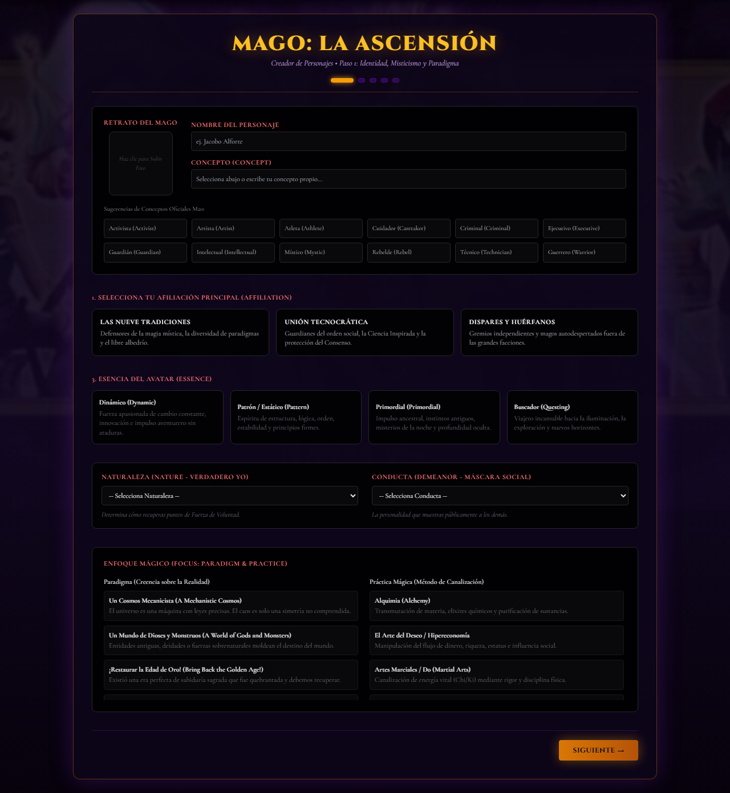

# 🔮 Mage Character Creator (M20)

Creador de personajes interactivo, no oficial, para **Mage: The Ascension 20th Anniversary Edition**. Guía al jugador paso a paso — identidad y paradigma, atributos, habilidades, esferas/trasfondos y puntos gratuitos — hasta generar una hoja de personaje final exportable.

   



## ✨ Características

- **Paso 1 — Identidad y Misticismo**: nombre, concepto, retrato, afiliación (Tradiciones / Tecnocracia / Dispares y Huérfanos), sub-facción con su Esfera de Afinidad, esencia del Avatar, Naturaleza/Conducta y Enfoque Mágico (24 Paradigmas × 24 Prácticas oficiales de M20).
- **Paso 2 — Atributos**: distribución por prioridad (7/5/3) sobre Físicos, Sociales y Mentales, con descripciones de cada rango.
- **Paso 3 — Habilidades**: distribución por prioridad (13/9/5) sobre Talentos, Técnicas y Conocimientos, con habilidades secundarias opcionales.
- **Paso 4 — Ventajas**: reparto de puntos entre las 9 Esferas mágicas y los Trasfondos (Avatar, Nodo, Recursos, Aliados, etc.).
- **Paso 5 — Toques finales**: gasto de los 15 Puntos Gratuitos según la tabla oficial de costes de M20, y generación de la hoja de personaje final con exportación a **JSON** o **PDF/impresión**.
- Tooltips de lore con reglas y trasfondo narrativo de cada término (`LoreTooltip`).
- Estética visual mística de M20: fondos índigo/violeta, acentos dorados/ámbar y tipografías Cinzel, Cormorant Garamond y Fira Code.

## 🛠️ Stack técnico

- [React 19](https://react.dev/) + [Vite](https://vitejs.dev/)
- [Tailwind CSS 3](https://tailwindcss.com/) (PostCSS + Autoprefixer)
- ESLint con reglas de React Hooks / React Refresh

## 🚀 Empezar

Requiere Node.js 18 o superior.

```bash
# clonar el repo
git clone https://github.com/Josedag11/mage-character-creator.git
cd mage-character-creator

# instalar dependencias
npm install

# levantar el servidor de desarrollo
npm run dev
```

Otros comandos disponibles:

```bash
npm run build     # build de producción en dist/
npm run preview   # sirve el build de producción localmente
npm run lint      # corre ESLint
```

## 📁 Estructura del proyecto

```
src/
├── components/       # Un componente por paso (Step1Identity … Step5FinalTouches) + LoreTooltip
├── data/              # Catálogos M20: paradigmas, prácticas, arquetipos, esferas, trasfondos…
├── App.jsx            # Estado del personaje y navegación entre pasos
└── index.css          # Tema visual (Tailwind + fuentes M20)
```

## 🗺️ Roadmap

- [ ] Guardado en `localStorage` para retomar un personaje a medias
- [ ] Importar un personaje desde un JSON exportado
- [ ] Validaciones adicionales de las reglas de creación de M20
- [ ] Modo claro/oscuro

Los PRs e issues son bienvenidos.

## ⚖️ Aviso legal

> Portions of the materials are the copyrights and trademarks of Paradox Interactive AB, and are used with permission. World of Darkness and Mage: The Ascension are trademarks of Paradox Interactive AB. This is a non-commercial fan project.

## 📄 Licencia

El código fuente de este repositorio se distribuye bajo la licencia [MIT](LICENSE). El contenido y las marcas de *Mage: The Ascension* / *World of Darkness* pertenecen a Paradox Interactive AB y no están cubiertos por esta licencia.
